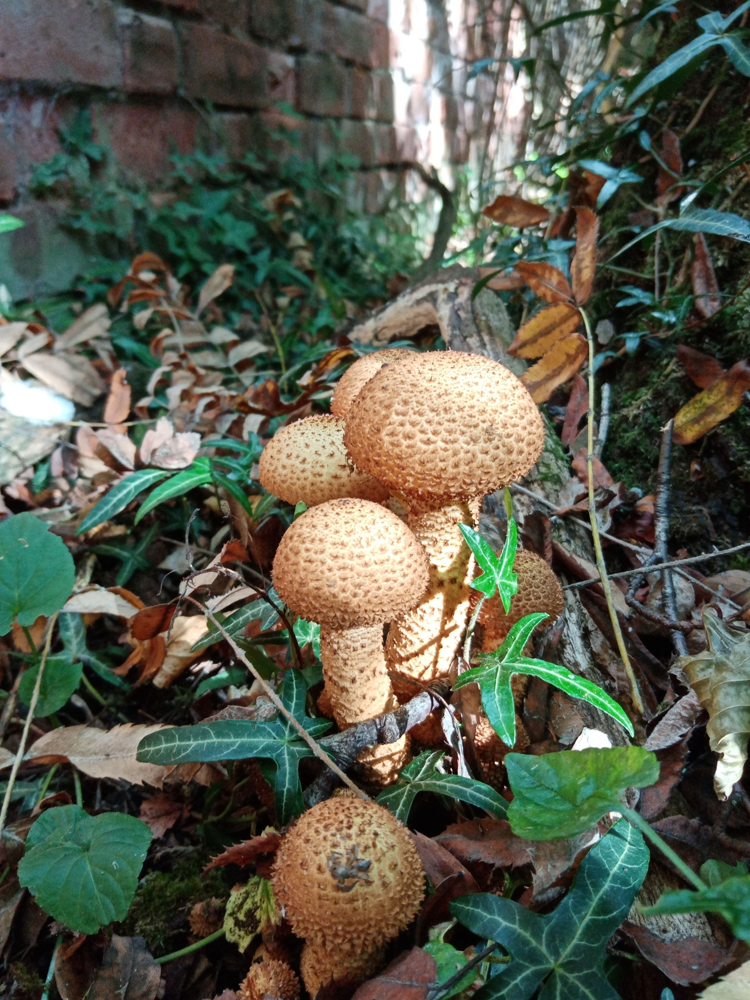
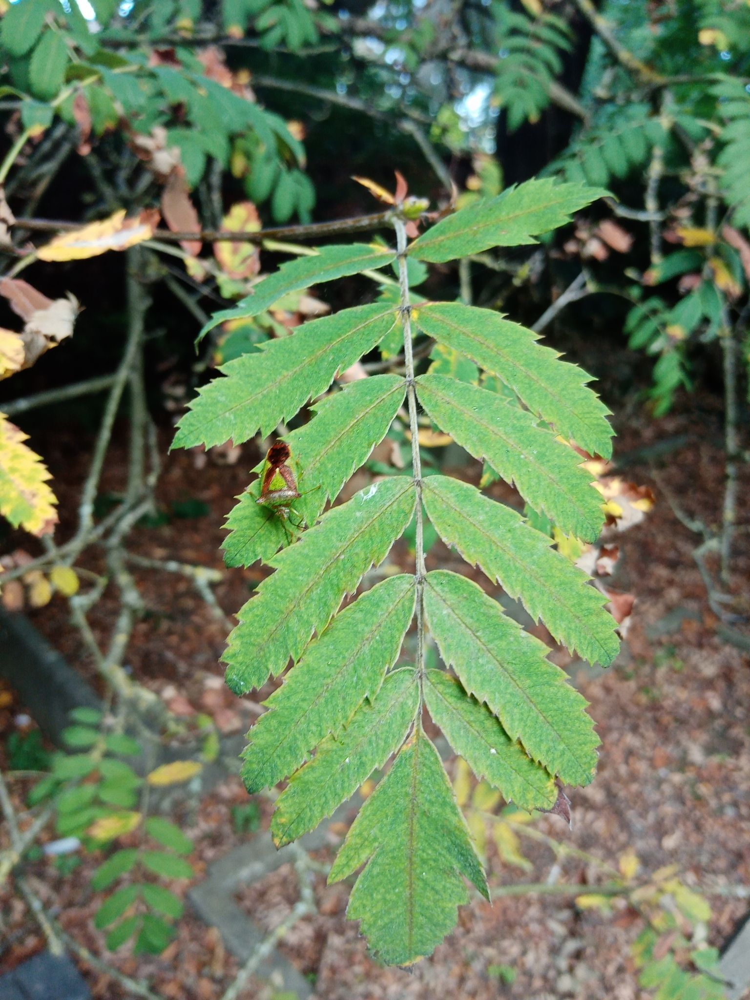

```{r xaringanExtra, echo = FALSE}
xaringanExtra::use_progress_bar(color = "#415E3E", location = "top")
```


```{r setup, include=FALSE}
options(htmltools.dir.version = FALSE)
```


## Aim

* Identify what organisms are associated with each native tree and 
other introduced trees in Britain.

* Investigate whether the number of organisms associated with each tree is
correlated to the length of time that species has been present in Britain.

* Identify under-studied tree species.

* Identify obligate organisms.

---

## Inspiration

.pull-left[

]

.pull-right[

]

---

.pull-left[

]

.pull-right[

]


---

## Relevance

* Focus on habitat-orientated conservation doesn't allow us to predict the 
species which can be supported in heavily modified, human-dominated ecosystems.

* Help assess the biodiversity value of native vs non-native woodlands.

* How can human-modified ecosystems be designed to conserve species.

* 

---

## Current Data Sources

* The Global Biotic Interactions Database (GloBI)

* Mitchell et al (2014) - Assessing and addressing the impacts of ash dieback on UK woodlands and trees of conservation importance

* Mitchell et al (2019) - OakEcol: A database of Oak-associated biodiversity within the UK 

* The Fungal Records Database of Britain and Ireland (FRDBI)

* THe British Lichen Society Database

* The Biological Records Centre (BRC) Database of Insects and their Food plants (DBIF)

---

## Associated Species - Sample

```{r sample_data, echo=FALSE, out.width = "100%"}

sample_data <- readRDS(file = "Output_Data/sample_interactions_data.rds")

DT::datatable(
  sample_data,
  fillContainer = FALSE, 
  rownames = FALSE,
  options = list(
    pageLength = 5,
    columnDefs = list(list(className = 'dt-center', targets="_all"))
    )
)


```


---

## Associated Species - Table

```{r assoc_spp, echo=FALSE, warning=FALSE, cache=FALSE, message=FALSE, out.width = "100%"}

data <- read.csv("Output_Data/species_time_data.csv")

data_t <- data |> 
  dplyr::select(-Growing_Time, -Tree_group) |> 
  tidyr::pivot_wider(id_cols = c(Species), values_from = Associated_Species, names_from = Taxon_group)

DT::datatable(
  data_t,
  fillContainer = FALSE, 
  rownames = FALSE,
  options = list(
    pageLength = 9,
    columnDefs = list(list(className = 'dt-center', targets="_all"))
    )
)

```


---

## The Species-Time Relationship

```{r species_time, echo=FALSE, warning=FALSE, cache=FALSE, message=FALSE}

data <- read.csv("Output_Data/species_time_data.csv") |> 
  dplyr::mutate_if(is.numeric, tidyr::replace_na, 0)

foo <- ggplot2::ggplot(data,
                       mapping = ggplot2::aes(x = Growing_Time,
                                              y = Associated_Species,
                                              color = Tree_group,
                                              label = Species)) +
  ggplot2::geom_point() +
  ggplot2::facet_wrap(~Taxon_group, scales = "free_y") +
  ggplot2::scale_y_continuous(trans='log10') +
  ggplot2::scale_x_continuous(trans='log10') +
  # ggplot2::scale_y_continuous(trans=scales::pseudo_log_trans(base = 10), 
  #                             # breaks = log_breaks(base = 10),
  #                             # expand = c(0, 0)
  #                             ) +
  # ggplot2::scale_x_continuous(trans=scales::pseudo_log_trans(base = 10), 
  #                             # breaks = log_breaks(base = 10),
  #                             # expand = c(0, 0)
  #                             ) +
  # ggplot2::scale_x_log10(limits = c(1e2,1e4)) +
  # ggplot2::scale_y_log10(limits = c(1,1e3)) +
  
  ggplot2::xlab("Years Present [Years]") +
  ggplot2::ylab("Associated Species [-]") +
  
  ggplot2::theme(
    
    panel.background =  ggplot2::element_rect(fill='transparent'),
    plot.background =  ggplot2::element_rect(fill='transparent', color = NA),
    
    legend.background =  ggplot2::element_rect(fill='transparent', color = NA),
    legend.box.background =  ggplot2::element_rect(fill='transparent', color = NA),
    legend.key = ggplot2::element_rect(fill = "transparent", color = NA),
    legend.title = ggplot2::element_blank(),
    
    axis.line = ggplot2::element_line(size = 0.5, colour = "grey80"),
    strip.background = ggplot2::element_rect(
      color='transparent', 
      fill='transparent', 
      size=1.5, 
      linetype="solid"
     )
  ) + 
  ggsci::scale_color_npg()


species_time_plotly <- plotly::ggplotly(foo,
                                        width = 940,
                                        height = 470,
                                        tooltip = c("Species", "Tree_group",
                                                    "Growing_Time", "Associated_Species")
                                        ) |>
  plotly::config(displayModeBar = FALSE)

# Adjust X axis plotly labels 
species_time_plotly[['x']][['layout']][['annotations']][[1]][['x']] <- 0.5
species_time_plotly[['x']][['layout']][['annotations']][[1]][['y']] <- -0.045

# Adjust y axis plotly labels
species_time_plotly[['x']][['layout']][['annotations']][[2]][['y']] <- 0.5
species_time_plotly[['x']][['layout']][['annotations']][[2]][['x']] <- -0.045


widgetframe::frameWidget(species_time_plotly)

```


---

class: center, middle

.pull-left[

]

.pull-right[

]

---

## The Species-Area Relationship

```{r species_area, echo=FALSE, warning=FALSE, cache=FALSE, message=FALSE}

species_area_df <- read.csv(file = "Output_Data/species_area_df.csv")

species_area_plot <- ggplot2::ggplot(data = species_area_df,
                                     mapping = ggplot2::aes(x = Area,
                                                            y = Associated_Species,
                                                            color = Tree_group,
                                                            label = Species)) +
  ggplot2::geom_point() +
  ggplot2::facet_wrap(~Taxon_group, scales = "free_y") +
  # ggplot2::scale_y_continuous(trans='log10') +
  # ggplot2::scale_x_continuous(trans='log10') +
  
  ggplot2::xlab("Area (2014) [1000 ha]") +
  ggplot2::ylab("Associated Species [-]") +
  
  
  ggplot2::theme(
    
    panel.background =  ggplot2::element_rect(fill='transparent'),
    plot.background =  ggplot2::element_rect(fill='transparent', color = NA),
    
    legend.background =  ggplot2::element_rect(fill='transparent', color = NA),
    legend.box.background =  ggplot2::element_rect(fill='transparent', color = NA),
    legend.key = ggplot2::element_rect(fill = "transparent", color = NA),
    legend.title = ggplot2::element_blank(),
    
    axis.line = ggplot2::element_line(size = 0.5, colour = "grey80"),
    strip.background = ggplot2::element_rect(
      color='transparent', 
      fill='transparent', 
      size=1.5, 
      linetype="solid"
     )
  ) + 
  ggsci::scale_color_npg()


species_area_plotly <- plotly::ggplotly(species_area_plot,
                                        width = 940,
                                        height = 470,
                                        tooltip = c("Species", "Tree_group",
                                                    "Area", "Associated_Species")) |>
  plotly::config(displayModeBar = FALSE)


# Adjust X axis plotly labels 
species_area_plotly[['x']][['layout']][['annotations']][[1]][['x']] <- 0.5
species_area_plotly[['x']][['layout']][['annotations']][[1]][['y']] <- -0.045

# Adjust y axis plotly labels
species_area_plotly[['x']][['layout']][['annotations']][[2]][['y']] <- 0.5
species_area_plotly[['x']][['layout']][['annotations']][[2]][['x']] <- -0.045

widgetframe::frameWidget(species_area_plotly)


```

---

class: center, middle

.pull-left[

]

.pull-right[

]

---

```{r oak_epi, echo=FALSE, fig.height=600}

knitr::include_graphics(path = "Images/Oak with Epiphytes.JPG")

```

---

## Source Analysis

---

## Biotic Interaction Classification

---

## Limitations

* GloBI data follows OBO Relations ontology

* FRDBI data has information on the substrate that the interaction was recorded
on, but only for some observations

* BLS data has no information on the nature of the interactions, though for 
Lichens the relationship is usually commensal, with Lichens as Epiphytes.

* DBIF data by nature records trophic interactions wherein the host tree is the 
food source of the insect

* Mitchell studies have notes for some species, but no structured classification
of interaction types.

---

## Limitations

* No information on the abundance or biomass of a given organism associated
with each tree.

* Limited information on the location (and therefore habitat and conditions) that
the interaction was recorded in.

---

## Next steps

* Attempt to get the authors of each of the datasets I have used to upload their
data to GloBI.

* Create a set of observation fields in iNaturalist which correspond directly to 
the GloBI relations ontology.

* Collate information from 'low-hanging fruits' in the literature (e.g. the BES
Biological Flora of the British Isles Papers) for inclusion in GloBI.

---

## References

* Alexander, Keith & Butler, J. & Green, T.. (2006). The value of different tree and shrub species to wildlife. British Wildlife. 18. 18-28. 

* Birks, H.J.B., 1980. British trees and insects: a test of the time hypothesis over the last 13,000 years. The American Naturalist, 115(4), pp.600-605.

* Evans, H. F. (1987). Sitka spruce insects: past, present and future. Proceedings of the Royal Society of Edinburgh. Section B. Biological Sciences, 93(1-2), 157–167.

* Kennedy, C.E.J. and Southwood, T.R.E., 1984. The number of species of insects associated with British trees: a re-analysis. The Journal of Animal Ecology, pp.455-478.

* Mitchell, R.J., Broome, A., Harmer, R., Beaton, J.K., Bellamy, P.E., Brooker, R.W., Duncan, R., Ellis, C.J., Hester, A.J., Hodgetts, N.G. and Iason, G.R., 2014. Assessing and addressing the impacts of ash dieback on UK woodlands and trees of conservation importance (Phase 2).

* Mitchell, R.J., Bellamy, P.E., Ellis, C.J., Hewison, R.L., Hodgetts, N.G., Iason, G.R., Littlewood, N.A., Newey, S., Stockan, J.A. and Taylor, A.F.S., 2019. OakEcol: A database of Oak-associated biodiversity within the UK. Data in brief, 25, p.104120.

* Southwood, T.R.E., 1961. The number of species of insect associated with various trees. The Journal of Animal Ecology, pp.1-8.


---
