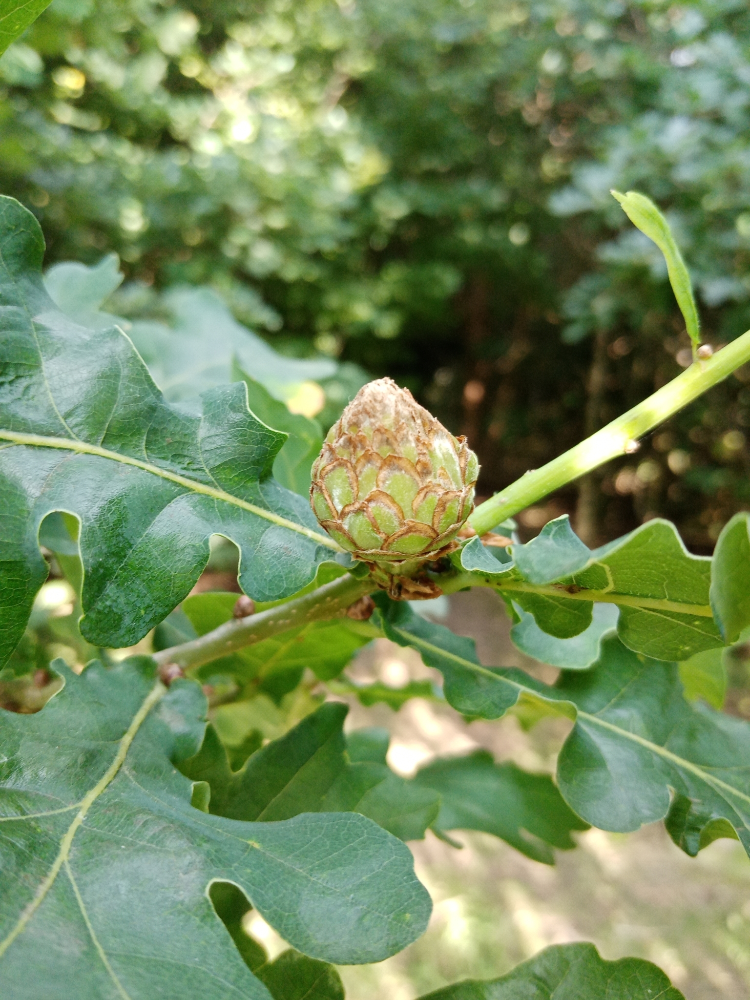

```{r xaringanExtra, echo = FALSE}
xaringanExtra::use_progress_bar(color = "#415E3E", location = "top")
```


```{r setup, include=FALSE}
options(htmltools.dir.version = FALSE)
```

---

class: center, middle

```{r echo=FALSE, out.width = "40%", eval=TRUE}

```

---

## The Species-Time Relationship

```{r, echo=FALSE, warning=FALSE, cache=FALSE, message=FALSE}

data <- read.csv("Output_Data/species_time_data.csv") |> 
  dplyr::mutate_if(is.numeric, tidyr::replace_na, 0)

foo <- ggplot2::ggplot(data,
                       mapping = ggplot2::aes(x = Growing_Time,
                                             y = Associated_Species,
                                             color = Tree_group,
                                             label = Species)) +
  ggplot2::geom_point() +
  ggplot2::facet_wrap(~Taxon_group, scales = "free_y") +
  ggplot2::scale_y_continuous(trans='log10') +
  ggplot2::scale_x_continuous(trans='log10') +
  # ggplot2::scale_y_continuous(trans=scales::pseudo_log_trans(base = 10), 
  #                             # breaks = log_breaks(base = 10),
  #                             # expand = c(0, 0)
  #                             ) +
  # ggplot2::scale_x_continuous(trans=scales::pseudo_log_trans(base = 10), 
  #                             # breaks = log_breaks(base = 10),
  #                             # expand = c(0, 0)
  #                             ) +
  # ggplot2::scale_x_log10(limits = c(1e2,1e4)) +
  # ggplot2::scale_y_log10(limits = c(1,1e3)) +
  ggplot2::theme(
    panel.background =  ggplot2::element_rect(fill='transparent'),
    plot.background =  ggplot2::element_rect(fill='transparent', color=NA),
    # panel.grid.major =  ggplot2::element_blank(),
    # panel.grid.minor =  ggplot2::element_blank(),
    legend.background =  ggplot2::element_rect(fill='transparent', color = NA),
    legend.box.background =  ggplot2::element_rect(fill='transparent', color = NA),
    legend.key = ggplot2::element_rect(fill = "transparent", color = NA),
    legend.title.align = 0.5,
    # legend.box.margin =  ggplot2::element_blank(), 
    axis.line = ggplot2::element_line(size = 0.5, colour = "grey80"),
    strip.background = ggplot2::element_rect(
      color='transparent', 
      fill='transparent', 
      size=1.5, 
      linetype="solid"
     )
  ) + 
  ggsci::scale_color_npg()

species_time_plotly <- plotly::ggplotly(foo,
                                        width = 1000,
                                        height = 500,
                                        tooltip = c("Species", "Tree_group",
                                                   "Growing_Time", "Associated_Species")
                                        ) |>
  plotly::config(displayModeBar = FALSE)

widgetframe::frameWidget(species_time_plotly)

```


---

---

---

---