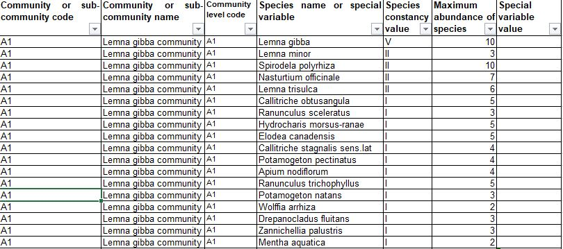
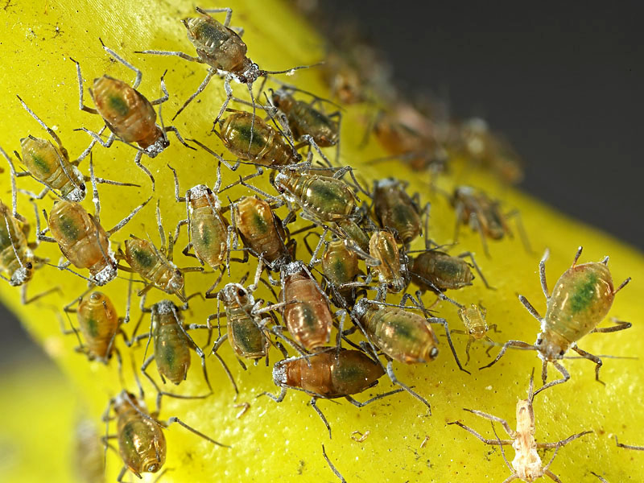
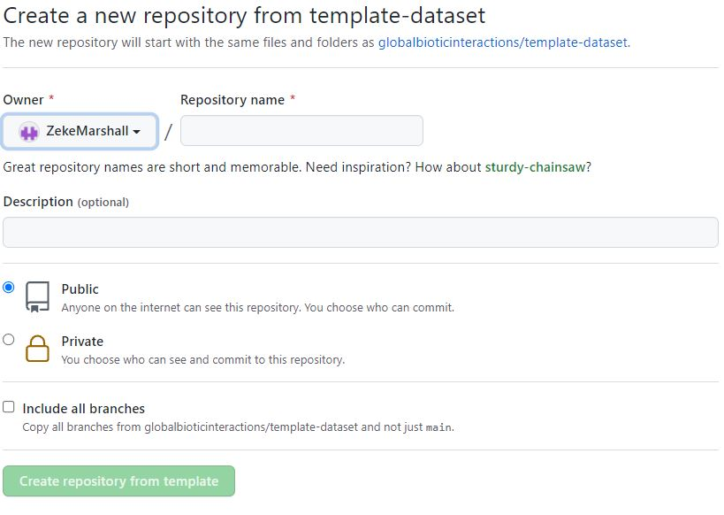

<style>
p.caption {
  font-size: 0.6em;
  font-style: italic;
}
</style>

```{r xaringanExtra, echo = FALSE}
xaringanExtra::use_progress_bar(color = "#415E3E", location = "top")
```


```{r setup, include=FALSE}
options(htmltools.dir.version = FALSE)

# Define custom color scale
myColors <- c("#a63e03", "#928802", "#0351a6", "#00A087FF")
names(myColors) <- c("Forestry conifers", "Forestry broadleaves", "Introduced", "Native")
custom_colors <- ggplot2::scale_colour_manual(name = "Tree groups", values = myColors)
custom_fill <- ggplot2::scale_fill_manual(name = "Tree groups", values = myColors)

```


## Aim

* Identify what organisms are associated with a range of native and non-native trees

* Investigate whether the number of organisms associated with each tree is
correlated to the length of time that species has been present in Britain.

* Identify under-studied tree species.

* Identify organisms which have only one interaction recorded with a tree.

---

## Inspiration

.pull-left[
```{r birks_1980, echo=FALSE, fig.align='center'}

knitr::include_graphics(path = "Images/Birks_1980.PNG")

```
]

.pull-right[

$$\\[0.15in]$$

```{r southwood_1961, echo=FALSE, fig.align='center'}

knitr::include_graphics(path = "Images/Southwood_1961.PNG")

```
]
---

## Inspiration

```{r Humphrey_2001, echo=FALSE, fig.align='center', out.width=680, out.height=520}

knitr::include_graphics(path = "Images/Humphrey_2001.JPG")

```


---

## Inspiration

.pull-left[
```{r Alexander_2006_L, echo=FALSE, fig.align='center'}

knitr::include_graphics(path = "Images/Alexander_2006_L.JPG")

```
]

.pull-right[
```{r Alexander_2006_R, echo=FALSE, fig.align='center'}

knitr::include_graphics(path = "Images/Alexander_2006_R.JPG")

```
]

---

## Relevance

* Help assess the biodiversity value of native vs non-native trees & woodlands.

* Analysing species occurrences doesn't explicitly tell us why a species is present in a habitat.

* Analysing species interactions may help us to predict the species which can be supported in 
heavily modified, human-dominated ecosystems.
---

## Sources

```{r source_analysis, echo=FALSE, warning=FALSE, cache=FALSE, message=FALSE}

data <- read.csv(file = "Output_Data/source_count.csv")

source_plot <- ggplot2::ggplot(data) + 
  ggplot2::geom_col(mapping = ggplot2::aes(x = study_source_citation,
                                           y = count,
                                           fill = study_source_citation)) +
  
  ggplot2::xlab("") +
  ggplot2::ylab("Number of Observations [-]") +
  
  ggsci::scale_fill_npg() +
  
  ggplot2::theme(
    
    panel.background =  ggplot2::element_rect(fill='transparent'),
    plot.background =  ggplot2::element_rect(fill='transparent', color = NA),
    
    axis.text.x = ggplot2::element_text(color = "black"),
    
    axis.text.y = ggplot2::element_text(color = "black"),
    
    legend.position = "none",
    
    axis.line = ggplot2::element_line(size = 0.5, colour = "grey80"),
    
    strip.background = ggplot2::element_rect(
      color='transparent', 
      fill='transparent', 
      size=1.5, 
      linetype="solid"
     )
  )
  

source_plotly <- plotly::ggplotly(source_plot,
                                  width = 1050,
                                  height = 470,
                                  tooltip = c("count")) |>
                   plotly::config(displayModeBar = FALSE)

# Adjust y axis plotly labels
source_plotly[['x']][['layout']][['annotations']][[2]][['y']] <- 0.5
source_plotly[['x']][['layout']][['annotations']][[2]][['x']] <- -0.055

widgetframe::frameWidget(source_plotly)


```

---

## Associated Species - Sample

```{r sample_data, echo=FALSE, out.width = "100%"}

sample_data <- readRDS(file = "Output_Data/sample_interactions_data.rds") |> 
  magrittr::set_colnames(c("Tree Species", "Associated Species", "Taxon Group", "Source"))

DT::datatable(
  sample_data,
  fillContainer = FALSE,
  rownames = FALSE,
  options = list(
    dom = 't',
    pageLength = 12,
    columnDefs = list(list(className = 'dt-center', targets="_all")),
    headerCallback = DT::JS(
      "function(thead) {",
      "  $(thead).css('font-size', '0.5em');",
      "}"
      )
    )
) |> 
  DT::formatStyle(columns = 1:ncol(sample_data), fontSize = '50%')


```


---

## Associated Species - Table

```{r assoc_spp, echo=FALSE, warning=FALSE, cache=FALSE, message=FALSE, out.width = "100%"}

data <- read.csv("Output_Data/species_time_data.csv")

data_t <- data |> 
  dplyr::select(-Growing_Time, -Tree_group) |> 
  tidyr::pivot_wider(id_cols = c(Species), values_from = Associated_Species, names_from = Taxon_group) |> 
  dplyr::select(Species, Bryophytes, Lichen, Fungi, Invertebrates, Birds, Mammals)

DT::datatable(
  data_t,
  fillContainer = FALSE, 
  rownames = FALSE,
  options = list(
    dom = 'tip',
    pageLength = 14,
    columnDefs = list(list(className = 'dt-center', targets="_all")),
    headerCallback = DT::JS(
      "function(thead) {",
      "  $(thead).css('font-size', '0.5em');",
      "}"
      )
    )
) |> 
  DT::formatStyle(columns = 1:ncol(data_t), fontSize = '50%')

```


---

## Testing for significant differences

```{r species_time_box, echo=FALSE, warning=FALSE, fig.align='center', include=TRUE, fig.width=18, fig.height=9, dpi=1000}

data <- read.csv("Output_Data/species_time_data.csv") |> 
 dplyr::mutate_if(is.numeric, tidyr::replace_na, 0)

data$Taxon_group <- factor(data$Taxon_group,                                
                           levels = c("Bryophytes", 
                                      "Lichen", 
                                      "Fungi", 
                                      "Invertebrates",
                                      "Birds",
                                      "Mammals"))

data$Tree_group <- factor(data$Tree_group,                                
                          levels = c("Forestry conifers", 
                                     "Forestry broadleaves", 
                                     "Introduced", 
                                     "Native"))


mult <- c(1, 1.03, 1.06, 1.09, 1.12, 1.17)

ttests <- data |> 
  dplyr::group_by(Taxon_group) |> 
  rstatix::t_test(Associated_Species ~ Tree_group, p.adjust.method = "bonferroni") |> 
  dplyr::select(-.y., -statistic, -df) |> 
  rstatix::add_x_position(x = "Tree_group") |> 
  rstatix::add_y_position(fun = "max",
                          y.trans = log10,
                          scales = "free_y") |> 
  dplyr::mutate(y.position = (y.position*mult))

box <- ggplot2::ggplot(data) +
  
  ggplot2::geom_boxplot(mapping = ggplot2::aes(x = Tree_group,
                                               y = Associated_Species,
                                               fill = Tree_group),
                        outlier.shape = NA) +
  
  ggplot2::scale_y_log10() +
  
  ggpubr::stat_pvalue_manual(ttests,
                             size = 6,
                             tip.length = 0.03,
                             label = "p.adj.signif") +
  
  custom_fill +
  
  ggplot2::theme_minimal() +
  
  ggplot2::theme(
    
    axis.text.x = ggplot2::element_blank(),
    axis.title.x = ggplot2::element_blank(),
    
    axis.text.y = ggplot2::element_text(size = 14, color = "black"),
    
    axis.title.y = ggplot2::element_text(size = 18, color = "black"),
    
    panel.background =  ggplot2::element_rect(fill='transparent', color = NA),
    plot.background =  ggplot2::element_rect(fill='transparent', color = NA),
    panel.border = ggplot2::element_blank(),
    
    legend.position = "bottom",
    legend.background =  ggplot2::element_rect(fill='transparent', color = NA),
    legend.box.background =  ggplot2::element_rect(fill='transparent', color = NA),
    legend.key = ggplot2::element_rect(fill = "transparent", color = NA),
    legend.title = ggplot2::element_blank(),
    legend.text = ggplot2::element_text(size = 18),
    
    axis.line = ggplot2::element_line(size = 0.5, colour = "grey80"),
    strip.background = ggplot2::element_rect(
      color='transparent', 
      fill='transparent', 
      size=1.5, 
      linetype="solid"
     )
    
  ) + 
  
  ggplot2::facet_wrap(~Taxon_group, scales = "free_y", nrow = 1) +
  
  ggplot2::theme(strip.text.x = ggplot2::element_text(size = 16, colour = "black", angle = 0)) +
  
  ggplot2::xlab("") +
  ggplot2::ylab("Associated Species [-]")

box


```

---

## The Species-Time Relationship

```{r species_time, echo=FALSE, warning=FALSE, cache=FALSE, message=FALSE, fig.align='center', fig.cap=paste("Please refresh page if the figure doesn't render correctly - will correct asap!")}

data <- read.csv("Output_Data/species_time_data.csv") #|> 
  # dplyr::mutate_if(is.numeric, tidyr::replace_na, 0)

data$Taxon_group <- factor(data$Taxon_group,                                
                           levels = c("Bryophytes", 
                                      "Lichen", 
                                      "Fungi", 
                                      "Invertebrates",
                                      "Birds",
                                      "Mammals"))

data$Tree_group <- factor(data$Tree_group,                                
                          levels = c("Forestry conifers", 
                                     "Forestry broadleaves", 
                                     "Introduced", 
                                     "Native"))

species_time_plot <- ggplot2::ggplot(data,
                                     mapping = ggplot2::aes(x = Growing_Time,
                                                            y = Associated_Species,
                                                            color = Tree_group,
                                                            label = Species)) +
  ggplot2::geom_point() +
  
  # ggplot2::geom_smooth(method = lm,
  #                      na.rm = TRUE,
  #                      fullrange = TRUE,
  #                      se = FALSE,
  #                      ggplot2::aes(group = 1, color = "Regression"),
  #                      size = 0.3,
  #                      colour = "grey") +

  # ggplot2::geom_text(data = r2_annot_total,
  #                    mapping = ggplot2::aes(x = 2500, y = 1, label = label, color = NA),
  #                    hjust = +1,
  #                    vjust = -1,
  #                    size = 3) +

  # ggpmisc::stat_poly_line(formula = formula,
  #                         ggplot2::aes(color = Tree_group),
  #                         size = 0.25,
  #                         se = FALSE
  #                         ) +
  # 
  # ggpmisc::stat_poly_line(formula = formula,
  #                         ggplot2::aes(group = 1, color = "Total"),
  #                         size = 0.25,
  #                         se = FALSE
  #                         ) +

  # # ggpmisc::stat_poly_eq() not yet supported by plotly
  # ggpmisc::stat_poly_eq(ggplot2::aes(label = stat(rr.label)),
  #                                    size = 3,
  #                                    alpha = 1,
  #                                    geom = "text_npc",
  #                                    formula = y ~ x) +
  
  
  
  ggplot2::facet_wrap(~Taxon_group, scales = "free_y") +
  
  ggplot2::scale_y_continuous(trans='log10') +
  ggplot2::scale_x_continuous(trans='log10') +
  
  # ggplot2::scale_y_continuous(trans=scales::pseudo_log_trans(base = 10), 
  #                             # breaks = log_breaks(base = 10),
  #                             # expand = c(0, 0)
  #                             ) +
  # ggplot2::scale_x_continuous(trans=scales::pseudo_log_trans(base = 10), 
  #                             # breaks = log_breaks(base = 10),
  #                             # expand = c(0, 0)
  #                             ) +
  # ggplot2::scale_x_log10(limits = c(1e2,1e4)) +
  # ggplot2::scale_y_log10(limits = c(1,1e3)) +
  
  ggplot2::xlab("Years Present [Years]") +
  ggplot2::ylab("Associated Species [-]") +
  
  ggplot2::theme(
    
    axis.text.x = ggplot2::element_text(size = 7, color = "black"),
    axis.title.x = ggplot2::element_text(size = 9, color = "black"),
    
    axis.text.y = ggplot2::element_text(size = 7, color = "black"),
    axis.title.y = ggplot2::element_text(size = 9, color = "black"),
    
    panel.background =  ggplot2::element_rect(fill='transparent'),
    plot.background =  ggplot2::element_rect(fill='transparent', color = NA),
    
    # legend.box.margin = 0.1,
    legend.background =  ggplot2::element_rect(fill='transparent', color = NA),
    legend.box.background =  ggplot2::element_rect(fill='transparent', color = NA),
    legend.key = ggplot2::element_rect(fill = "transparent", color = NA),
    legend.title = ggplot2::element_blank(),
    
    axis.line = ggplot2::element_line(size = 0.5, colour = "grey80"),
    strip.background = ggplot2::element_rect(
      color='transparent', 
      fill='transparent', 
      size=1.5, 
      linetype="solid"
     )
  ) + 
  
  custom_colors


species_time_plotly <- plotly::ggplotly(species_time_plot,
                                        width = 980,
                                        height = 450,
                                        tooltip = c("Species", "Tree_group",
                                                    "Growing_Time", "Associated_Species")
                                        ) |>
  plotly::config(displayModeBar = FALSE)

# Adjust X axis plotly labels 
species_time_plotly[['x']][['layout']][['annotations']][[1]][['x']] <- 0.5
species_time_plotly[['x']][['layout']][['annotations']][[1]][['y']] <- -0.045

# Adjust y axis plotly labels
species_time_plotly[['x']][['layout']][['annotations']][[2]][['y']] <- 0.5
species_time_plotly[['x']][['layout']][['annotations']][[2]][['x']] <- -0.0375


widgetframe::frameWidget(species_time_plotly)

```


---

class: center, middle

.pull-left[

]

.pull-right[

]

---

class: center, middle

.pull-left[

]

.pull-right[

]

---


```{r oak_epi, echo=FALSE, out.height=600, out.width=800, fig.align='center'}

knitr::include_graphics(path = "Images/Oak with Epiphytes.JPG")

```


---

## Limitations

* FRDBI data has information on the substrate that the interaction was recorded
on, but only for some observations

* BLS data has no information on the nature of the interactions, though for 
Lichens the relationship is usually commensal, with Lichens as Epiphytes.

* DBIF data by nature records trophic interactions wherein the host tree is the 
food source of the insect

* Mitchell studies have notes for some species, but no structured classification
of interaction types.

* No information on the abundance or biomass of a given organism associated
with each tree.

* Limited information on the location (and therefore habitat and conditions) that
the interaction was recorded in.

---

## From Trees to NVC Communities

.pull-left[

* Query GloBI for species recorded as interacting with each plant species
in each NVC community using the floristic tables

* Iteratively query GloBI to create an ecological network for each NVC community

* Compare these networks to networks for plantation forests



]

.pull-right[

$$\\[0.25in]$$


]

---

## Iteration 1

### NVC A1 - Lemna gibba community

```{r nvc, echo=FALSE, warning=FALSE, cache=FALSE, message=FALSE, out.width = "100%"}

data <- read.csv("Output_Data/a1_assoc_spp.csv") |> 
  dplyr::slice(-1) |> 
  dplyr::select(Community.or.sub.community.code,
                Species.constancy.value,
                Maximum.abundance.of.species,
                NVC_Species,
                Assoc_Species,
                interactionTypeName) |> 
  magrittr::set_colnames(c("Code",
                           "Species constancy",
                           "Maximum Abundance",
                           "NVC Species",
                           "Associated Species",
                           "Interaction Type"))

DT::datatable(
  data,
  fillContainer = FALSE,
  rownames = FALSE,
  options = list(
    dom = 'tip',
    pageLength = 11,
    columnDefs = list(list(className = 'dt-center', targets="_all")),
    headerCallback = DT::JS(
      "function(thead) {",
      "  $(thead).css('font-size', '0.5em');",
      "}"
      )
    )
  ) |>
  DT::formatStyle(columns = 1:ncol(data), fontSize = '50%')


```

---

## Iteration 1

### Rhopalosiphum nymphaeae eats Lemna gibba

.pull-left[

]

.pull-right[

]

---

## Iteration 1

```{r network, echo=FALSE, message=FALSE, warning=FALSE, dpi=1500}

data <- read.csv("Output_Data/a1_assoc_spp.csv") |> 
  dplyr::slice(-1)

nvc_spp <- unique(data$NVC_Species)

assoc_spp <- unique(data$Assoc_Species)

spp <- c(nvc_spp, assoc_spp)

nodes <- data.frame("id" = spp) |> 
  dplyr::mutate(
    group = dplyr::case_when(
      id %in% nvc_spp ~ "NVC",
      id %in% assoc_spp ~ "Assoc",
      TRUE ~ as.character(id)
      )
    ) |> 
  dplyr::mutate("label" = id,
                "title" = paste0("<b>", id,"</b>")) |> # <h5>Fifth-Order</h5>
  dplyr::distinct()

edges <- data |> 
  dplyr::select(NVC_Species, Assoc_Species, interactionTypeName) |>
  dplyr::mutate("label" = interactionTypeName) |>
  magrittr::set_colnames(c("from", "to", "title", "label"))


set.seed(12)

foo <- visNetwork::visNetwork(nodes, edges) |> 
  visNetwork::visOptions(highlightNearest = TRUE,
                         nodesIdSelection = list(enabled = TRUE, selected = "Rhopalosiphum nymphaeae")) |> 
  
  visNetwork::visGroups(groupname = "NVC", color = "#70e858", alpha = 0.5) |> 

  visNetwork::visGroups(groupname = "Assoc", color = "#f75b40", alpha = 0.5) |> 

  visNetwork::visEdges(smooth = FALSE, 
                       arrows = "from",
                       color = "grey",
                       selectionWidth = 0,
                       ) |> 
  visNetwork::visPhysics(solver = "barnesHut",
                         stabilization = TRUE) |> 
  visNetwork::visIgraphLayout()

widgetframe::frameWidget(foo)

```

---

## Iteration 2

### Ischidon scutellaris eats Rhopalosiphum nymphaeae

.pull-left[

]

.pull-right[

]

---

## How to contribute

.pull-left[

]

.pull-right[

]

---

## References

* Alexander, Keith & Butler, J. & Green, T.. (2006). The value of different tree and shrub species to wildlife. British Wildlife. 18. 18-28. 

* Birks, H.J.B., 1980. British trees and insects: a test of the time hypothesis over the last 13,000 years. The American Naturalist, 115(4), pp.600-605.

* Cooper, J. and Kirk, P., 2006. Fungal Records Database of Britain and Ireland. British Mycological Society.

* Evans, H. F. (1987). Sitka spruce insects: past, present and future. Proceedings of the Royal Society of Edinburgh. Section B. Biological Sciences, 93(1-2), 157–167.

* Humphrey, J.W., Ferris, R., Jukes, M. and Peace, A., 2001. Biodiversity in planted forests. Forest Research Annual Report and Accounts 2000–2001.

* Kennedy, C.E.J. and Southwood, T.R.E., 1984. The number of species of insects associated with British trees: a re-analysis. The Journal of Animal Ecology, pp.455-478.

* Mitchell, R.J., Broome, A., Harmer, R., Beaton, J.K., Bellamy, P.E., Brooker, R.W., Duncan, R., Ellis, C.J., Hester, A.J., Hodgetts, N.G. and Iason, G.R., 2014. Assessing and addressing the impacts of ash dieback on UK woodlands and trees of conservation importance (Phase 2).

---

* Mitchell, R.J., Bellamy, P.E., Ellis, C.J., Hewison, R.L., Hodgetts, N.G., Iason, G.R., Littlewood, N.A., Newey, S., Stockan, J.A. and Taylor, A.F.S., 2019. OakEcol: A database of Oak-associated biodiversity within the UK. Data in brief, 25, p.104120.

* Poelen, J.H., Simons, J.D. and Mungall, C.J., 2014. Global biotic interactions: An open infrastructure to share and analyze species-interaction datasets. Ecological Informatics, 24, pp.148-159.

* Simkin, J., 2012. The BLS database project. Br Lichen Soc Bull, 111, pp.8-14.

* Smith, R.M. and Roy, D.B., 2008. Revealing the foundations of biodiversity: The database of British insects and their foodplants. British Wildlife, 20(1), pp.17-25.

* Southwood, T.R.E., 1961. The number of species of insect associated with various trees. The Journal of Animal Ecology, pp.1-8.

---

class: center, middle

## Comments, Questions, and Suggestions!

---
